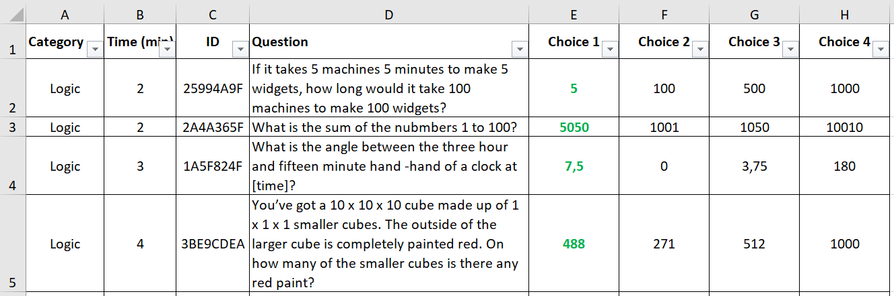

# quiz

**Description:** Build a weighted random quiz based on a selection of questions and correct it.

**Online Preview:** [http://aberraxao.pythonanywhere.com/](http://aberraxao.pythonanywhere.com/)
  * User: superuser
  * Password: superpassword

## **How to use:**
1. Generate a 'password' for the 'user' by either:
  * A) Open the file [Results Dashboard](/Results Dashboard.xlsm)
    * Enable macros
    * Fill on the sheet 'Dashboard' the columns 'User" and 'Theme'
    * Fill G1 with [http://localhost:5000](http://localhost:5000) if you're using a local server.
    Otherwise, you can use [http://aberraxao.pythonanywhere.com/](http://aberraxao.pythonanywhere.com/)
    * Click on the button 'Get Passwords'
  * B) Replace *REPLACEUSER* by your *username* and replace *REPLACETHEME* by an *existent theme* as per [config.csv](/static/config.csv): 
    * If you're using a local server: [http://localhost:5000/sha?user=superuser&pwd=superpwd&email=REPLACEUSER&theme=REPLACETHEME](http://localhost:5000/sha?user=superuser&pwd=superpwd&email=REPLACEUSER&theme=REPLACETHEME)
    * Otherwise: [http://aberraxao.pythonanywhere.com/sha?user=superuser&pwd=superpwd&email=REPLACEUSER&theme=REPLACETHEME](http://aberraxao.pythonanywhere.com/sha?user=superuser&pwd=superpwd&email=REPLACEUSER&theme=REPLACETHEME)
    This will generate a password encoded with sha-256 limited to 15 characters.
    
2. Fill the log-in details with the 'user' and 'password' from the step above and press 'START':

    

3. Reply to the questions and at, the end, click on 'Save and Quit' to see how many answers you got right!
* *Currently the detection of the start of the quiz is based on saving the quiz for the first time.*
* *The answers are kept in [results.db](/results.db) for future analysis.*

## **How to modify:**
* The questions are stored in [question.xlsx](/static/questions.xlsx):
  * To simplify, the correct answer calways orresponds to the "Choice 1"
  * Tabs are not supported, instead we 4 spaces should be used
      
  
* The duration of the quiz and weights of each category an be defined in [config.csv](/static/config.csv):
    | Theme     | Time (min) | Logic | VBA  | Python | Code |
    |-----------|------------|-------|------|--------|------|
    | No VBA    | 10         | 0.2   | 0.2  | 0      | 0.6  |
    | No Python | 10         | 0.2   | 0.2  | 0.6    | 0    |
    | Generic   | 10         | 0.25  | 0.25 | 0.25   | 0.25 |
